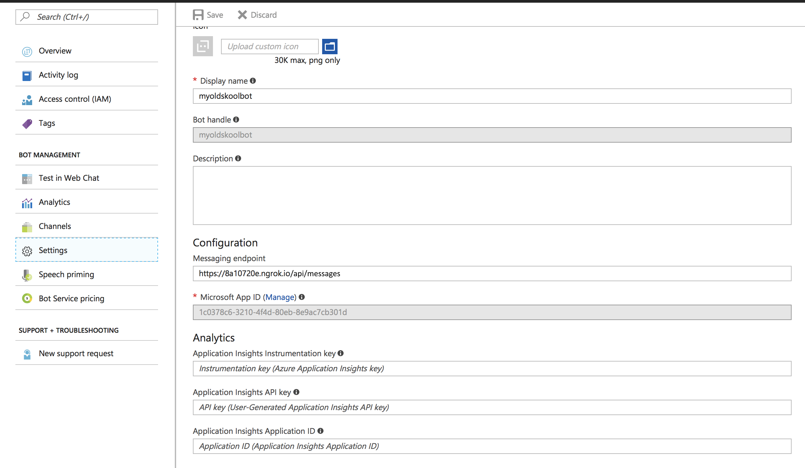

# Game-A-Tron 3000
This repo contains a game-engine for an old-skool 8 bit adventure game. The game was inspired by games from the eighties and nineties like Monkey Island, Day of the Tentacle, Full Throttle, Grim Fandango, etc.

The engine contains 2 parts: a front-end part ("the game") and a back-end part ("the engine"). 
The front-end is a Javascript (Typescript) based engine built on top of the **Phaser HTML5 game framework**.
The back-end is built on top of the **Microsoft Bot framework**.

<iframe width="560" height="315" src="https://www.youtube.com/embed/0ZAaik-S9n8?rel=0&amp;start=410" frameborder="0" allow="autoplay; encrypted-media" allowfullscreen></iframe>

This README will explain how to run both the front-end and back-end locally. You will need to use the Azure Portal to register the bot though.

## Registering the Bot
The front-end requires a direct connection link to the bot. To make this work, we first need to register the bot in the Azure portal.
Since we’re not hosting the bot code itself in Azure we can use a *Bot Channels Registration* resource to register the bot. To make our local running instance available to the Portal we can use a tool called **ngrok**. Ngrok provides us with a proxy address which is reachable from the cloud and can tunnel traffic to localhost. For more information see [Debug any Channel locally using ngrok - Microsoft Bot Framework](https://blog.botframework.com/2017/10/19/debug-channel-locally-using-ngrok/).

Download [ngrok](https://ngrok.com) and run the following command (the bot will run locally on port 3979):

```
ngrok http -host-header=rewrite 3979
```

Some information is shown including an https forwarding address:


Now go to the Azure portal and create a new *Bot Channels Registration* resource. Use the https address from ngrok for the messaging endpoint (postfixed with `/api/messages`):


## Setting up Bot security
We now need to generate a new Microsoft App Password to secure the connection between the Portal and the bot.
In the newly created *Bot Channels Registration* resource, go to *Settings*:



Click on the Microsoft App ID *Manage* link to open the bot registration page. Then click *Generate New Password* and save the password somewhere because you’ll need it later on. Also make a note of the *Application Id*.


Click the *Save* button on the bottom on the page.

## Run the Bot
Open the **GameATron3000** solution from the *bot* folder. Edit the *Web.config* file and set the *MicrosoftAppId* and *MicrosoftAppPassword* using the *Application Id* and generated *Password* values from the previous section.

Now run the *Bot* project and a browser window should open showing the following message:


If you go back to the Portal and navigate to *Test in Web Chat* on the *Bot Channels Registration* resource, you can test whether the connection to the bot is set up successfully. Type in the `look at newspaper` command and you should receive a reply from the bot.

## Setting up the Direct Line channel
Because we want to play using an awesome 8-bit front-end instead of a chat box, we need to configure a Direct Line channel that the front-end will use to communicate with the bot.

Navigate to *Channels* on the *Bot Channels Registration* resource. Here you can configure the Direct Line channel by clicking on the *Configure Direct Line channel* button (globe icon). 


Click the *Show* button for the first secret key and copy its value. Then click *Done*.

Open the front-end project by opening the root-folder of the repo in Visual Studio Code. 

Execute an *npm install* in the root-folder of the repo to make sure you have everything to run the front-end.

Open the *src/settings.ts* file.
Set the *BOT_ID* variable to the name you’ve chosen for your bot (which is the name of the *Bot Channels Registration* resource).
Set the *DIRECT_LINE_SECRET* variable to the secret key value you’ve copied from the Direct Line configuration page.

Now you can run the front-end (*Ctrl-Shift-B*) and it will communicate with the bot to start your adventure!


